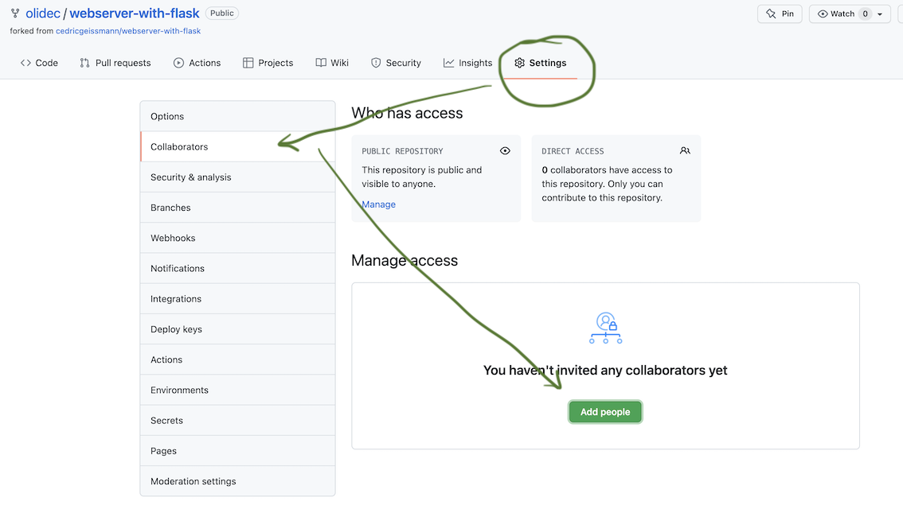

# A Small Project

A small group project in which you will repeat and practice the basics of HTML, CSS, templates, webscraping and git. In the end you will have created a small website with a structure and interactive features.

This project will not be graded.

## Goals
The end product of this project should be a website with multiple pages that have similar stylings (using templates). At a minimum the website should contain
- a starting page (index.html),
- personal "bio" pages (including a picture) of each person in the group,
- a group page showing a summary of the previous "bios" all together on one page.
- an interactive page (e.g. a quiz or similar)
- a page on which you collect and represent data that you have collected from the web using webscraping (e.g. showing a random headline from a news site).

Furthermore, the higher level goals for this project are:
- Preparation for the project after the holidays - especially using the collaborative capabilities of github and gitpod.
- Repetition of the key concepts for the next exam:
    - HTML/CSS
    - webscraping
    - templates
    - git

## Technical Details
- You will work in groups of three people (maybe two).
- The project time is two weeks, including the labs - so communicate within your group if you are not in the same lab group.
- Your work should be done on a github repository, where the group members and the teacher are added as contributors. 
- In the beginning you will be provided with a github repository that you should fork. 
    - For 1MZ: <https://github.com/cedricgeissmann/quiz>
    - for 1E: <https://github.com/olidec/quiz>
- When you hand in your final result, you will send a pull request to the repository you originally forked from. This request will be denied, but this way we can see your work and also who contributed what.

## Very Important
**Have fun!**

## Assignments and Possible Order of Working

Obviously, some of these assignments should be done at the very beginning and some at the very end. However, in between it is up to you how you want to split up and tackle these. 

1. Decide on your groups.
2. One person in each group forks the starting repository and adds the others and the teacher as collaborators: 

3. Create branches for each feature you want to work on and merge them in as you finish them.
4. At some point you have to think about an overall styling of your webpage - given by the basic template. You may want to think about this and do this assignment later, as the styling may depend on the type of webpage you are designing.
4. Create a "profiles" template and the profile webpage.
5. Based on the "profiles" pages create a profile summary page.
6. Create a webscraping program and run it to save data in a file or folder.
7. Style and code a page to show your webscraping result.
8.  Using the basic quiz given, adapt and improve it so that you're happy.
9. Hand in your assignment by issuing a pull request to the original repository from which you forked it.